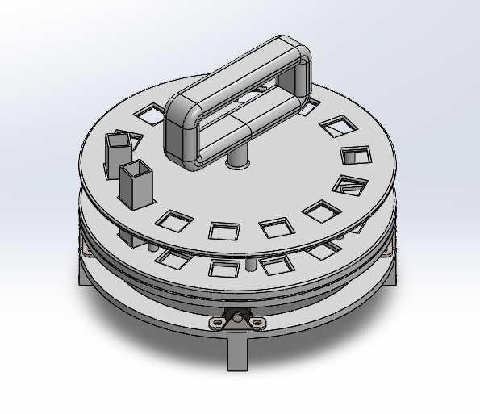

# Nathan (Anders) Anderson
## Mechanical Engineer | University of Washington

Welcome to my portfolio! I'm Anders, a current student at the University of Washington graduating with my Master's Degree of Mechanical Engineering in August 2026. My focus is on control systems, dynamics, and systems theory, but versatility is very important to me, and I strive to maintain a broad skillset from CAD design to manufacturing. As you explore this site, you'll get to understand my skillset, how I can back up that skillset, and maybe some of the flat out interesting projects I've worked on. This will include anything in which I demonstrated my professional skills, or gained proficiency in new, industry relevant skills. Enjoy!

## RoboFly Actuator Redesign | 2025-2026

- Concept generation
- Governing equations
- Design
- Analysis
- Experimentation
- Testing

## Detecting Radioactive Iodine from Thermal Salts (DRIFTS) | 2023-2025

- Concept generation
- Governing equations
- Design
- Analysis
- Experimentation
- Testing

## Functional Live Assesment of Vital Albumin (FLAVA) | 2025

- Concept generation
- Governing equations
- Design
- Analysis
- Experimentation
- Testing

## 3D Printed High Laptop Stand | 2025

- Concept generation
- Governing equations
- Design
- Analysis
- Experimentation
- Testing

## Autonomous Orchid Care System | 2024

- Concept generation
- Governing equations
- Design
- Analysis
- Experimentation
- Testing

## Remote Control Car | 2024

- Concept generation
- Governing equations
- Design
- Analysis
- Experimentation
- Testing

## Portable Modular Samplers for Detecting Atmospheric Radioisotopes | 2021-2022

- Concept generation
- Governing equations
- Design
- Analysis
- Experimentation
- Testing
